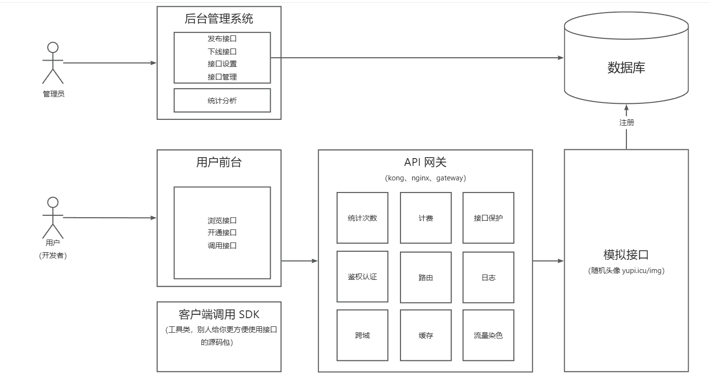

## 项目背景

API接口调用平台，帮助企业、个人统一开放接口，减少沟通成本，避免重复造轮子，为业务高效赋能。

- 普通用户：注册登录，开通接口调用权限，使用接口。

- 后台：调用统计和可视化分析接口调用情况，管理员发布接口、下线接口、新增接口。

主要功能：

- API接入
- 防止攻击（安全性）
- 不能随便调用（限制、开通）
- 统计调用次数
- 计费
- 流量保护

架构图：

技术选型：

后端：

- Spring Boot
- Spring Boot Starter(SDK开发)
- Dubbo (RPC)
- Nacos(注册中心)
- Spring Cloud Gateway(网关、限流、日志实现)

启动方式：

后端：

- mingapi-backend：7529端口，后端接口管理（上传、下线、用户登录） 在线调试地址：http://localhost:7529/api/doc.html
- mingapi-gateway：8090端口，网关
- mingapi-interface：8123端口，提供各种接口服务（该服务可以部署在多个服务器上）。注意：这里的tests有个测试Dubbo发送请求是否能够跑通的测试用例。
- mingapi-client-sdk：客户端SDK，无端口，发送请求到8090端口，由网关进行转发到后端的mingapi-interface

详细设计文档：

- 见doc目录下
